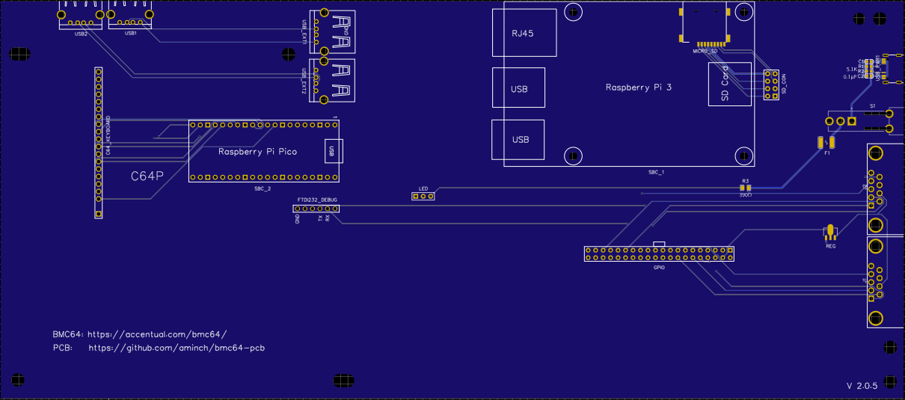
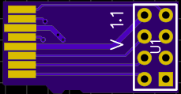
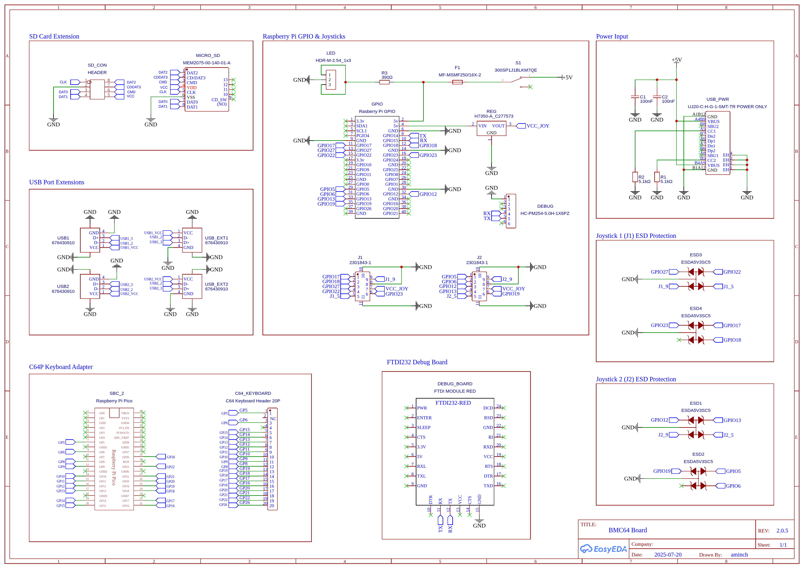
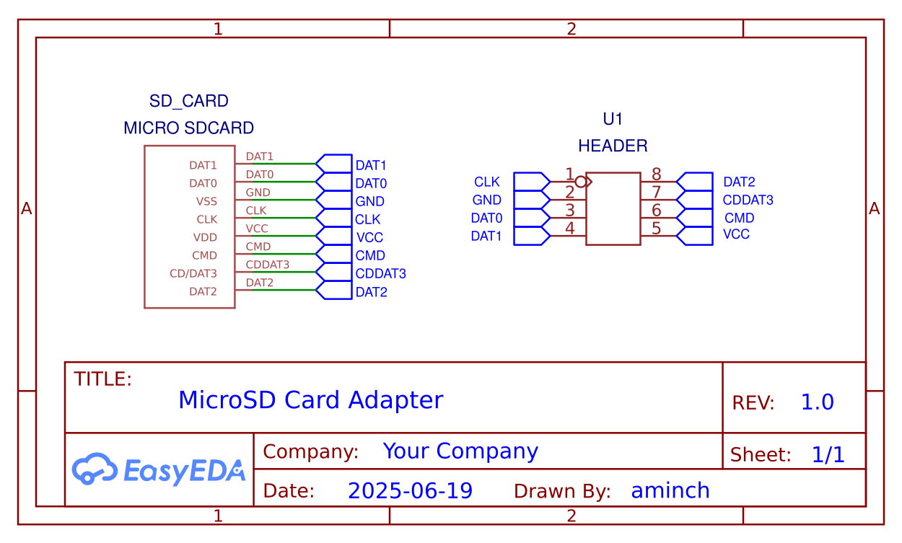
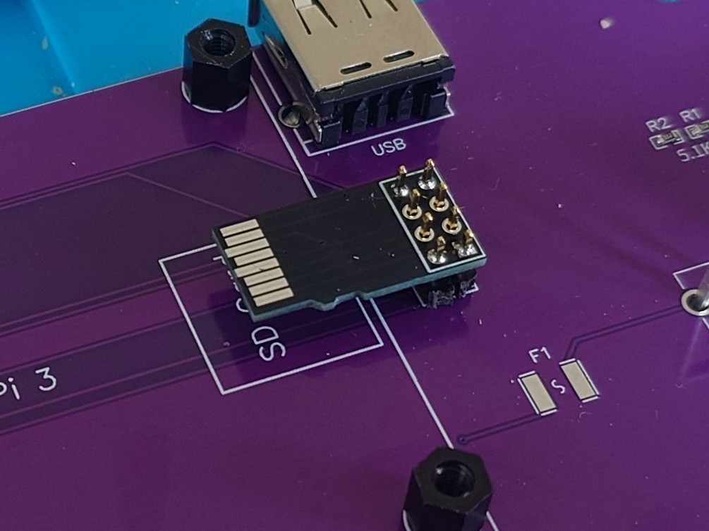
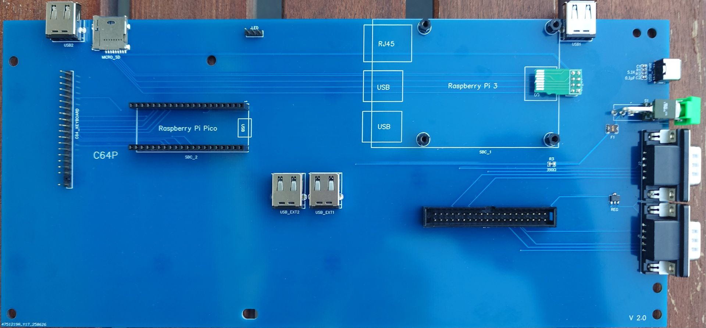
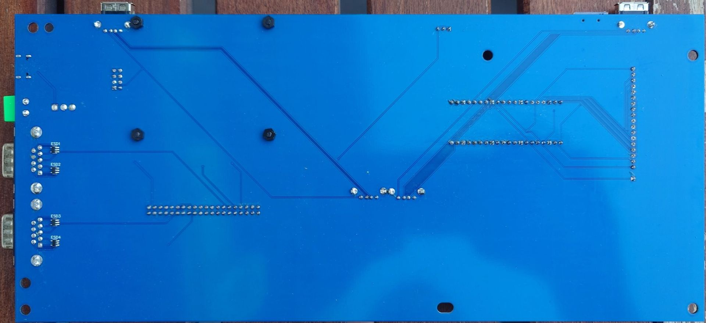
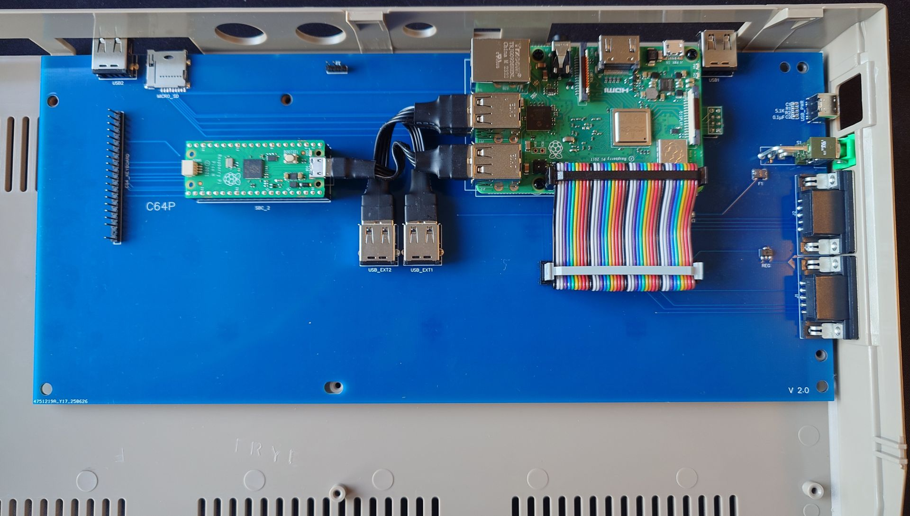

# BMC64 PCB (Longboard)

The longboard is effectively **DEPRECATED** for now. It's still a great board, but won't get any more updates for now. 

If you want to build a BMC64 machine with a Raspberry Pi 3B+ this board will still work great! 

The features it's missing are:

 * Limited to USB 2.0 extensions (but this probably has zero practical effect)
 * Doesn't support Mechboard 64 without [modification](MODIFICATIONS.md) 
 * C64P stuck on firmware v3.0 without [modification](MODIFICATIONS.md)

If there is interest in the longboard I can look into bringing it back in the feature. Create an issue if you're interested and let me know why you would prefer this longboard. 

---

This Longboard README details how to build the v 2.0.5 of the BMC64 PCB, which was the last version of the larger PCB before it was redesigned into the [shortboard](README.md) format from v 2.2 and onward. This repository also contains gerbers, schematics and images for all previous versions in the appropriate folders.

---

The BMC64 PCB combines together a [Raspberry Pi 3B+](https://www.raspberrypi.com/products/raspberry-pi-3-model-b-plus/), [Rasberry Pi Pico](https://www.raspberrypi.com/products/raspberry-pi-pico/), original joystick ports, and USB-C power in a single drop-in board which fits straight into an original breadbin or C64C case.  It's powered by the fantastic C64 emulator [BMC64](https://accentual.com/bmc64/) and all ports are moved to suitable positions for an original C64 case for easy access without any case modifications needed! You can also connect an on/off LED indicator into the original spot in the case.

- [BMC64 PCB (Longboard)](#bmc64-pcb-longboard)
  - [PCBs \& Parts](#pcbs--parts)
    - [Main PCB - Longboard](#main-pcb---longboard)
    - [MicroSD card adapter board](#microsd-card-adapter-board)
    - [BOM](#bom)
    - [Ordering PCBs](#ordering-pcbs)
    - [Schematics](#schematics)
  - [Assembly](#assembly)
  - [Software](#software)
    - [Alternative software](#alternative-software)
    - [Compatibility](#compatibility)
  - [History](#history)
    - [2.0.5](#205)
    - [2.0.4](#204)
    - [2.0.1](#201)
    - [1.2.1](#121)
    - [1.2](#12)
    - [Pre-PCB solutions](#pre-pcb-solutions)
  - [Disclaimer](#disclaimer)

## PCBs & Parts

### Main PCB - Longboard

### MicroSD card adapter board

 The adapter board is used to connect the MicroSD slot on the Raspberry Pi 3B+ to the main PCB

### BOM

Full [BOM (Longboard)](bom/longboard-bom.md) of parts needed.

### Ordering PCBs

I ordered the PCBs via [JLCPCB](https://jlcpcb.com/) with just the standard settings. The main PCB was the standard 1.6mm thick, but it is important to order the MicroSD adapter board in **0.6mm** or **0.8mm** thick or it will be too big to fit into the microSD slot on the Raspberry Pi 3B+!

Check the Releases, or `gerbers` folder for the gerber files.

### Schematics

## Assembly

The first step in assembly is to attach the microSD adapter board. We will do this by inserting the adapter into the Raspberry Pi 3B+, loosely assembling it in place, then tack soldering the adapter board to the correct location:
 
 * Attach the M2.5 nylon stand-offs to the four corners on the board where the Raspberry Pi 3B+ will be mounted.
 * Cut two 1x4 sets of header pins from the 1x20 header pins in the [BOM](bom/bom.md).
 * Slide the MicroSD adapter into the Raspberry Pi 3B+.
 * Place the 2 sets of 1x4 headers on the main PCB.
 * Place the Raspberry Pi 3B+ on the nylon stand-offs while inserting the header pins into the MicroSD card adapter.
 * Put one (or more) screws into the Raspberry Pi 3B+ to hold everything in place.
 * Place solder on the outer pins on top to holder the header pins in place
 * Flip the board and solder the outer pins on the headers too.
 * Flip the board and carefully remove the Raspberry Pi 3B+, and it should look like the picture below.

 * Confirm that the positioning is ok by placing the Raspberry Pi 3B+ back on the adapter.
 * Adjust the board if needed by reheating the solder on the pins until you're happy.
 * Remove the Raspberry Pi 3B+ again.
 * Complete the final soldering on all of the header pins.

All of the other parts are labelled on the board. Start with the smallest components and work your way up until everything is attached. The list of parts to attach are below and the finished board should look as in the picture:

 * USB-C power port, 2x 5.1K resistors and 2x 0.1µF capacitors
 * Main power switch and fuse
 * 2x DB9 joystick ports and IC Regulator 
 * GPIO header
 * 390ohm resistor & 1x3 LED header
 * 4x USB ports
 * 1x20 header pins (for C64 keyboard)
 * 2x 1x20 female headers for mounting the Raspberry Pi Pico
 * MicroSD card slot
 * 1x6 female header for FTDI232 debug points (optional)

You'll need to flip the board for the final components

 * 4x TVS diodes in the ESD1-4 positions next to the joysticks

To assemble the final parts:

 * Push the Raspberry Pi Pico into the female headers on the board.
 * Attach the Raspberry Pi 3B+ to the nylon stand-off with screws being careful to slide in the microSD card adapter in the process.
 * Attach the Raspberry Pi Pico to the Raspberry Pi 3B+ with a short usb micro-A cable.
 * Connect the two USB_EXT ports to one of the Raspberry Pi 3B+'s usb ports with the short usb A-A cables.
 * Connect the Raspberry Pi 3B+ to the GPIO connector with the 40pin GPIO ribbon cable. (Note: Cut the cable to suit if desired)
 * Replace the plastic switch on the main switch with the smaller one included in the [BOM](bom/bom.md). (This is needed for the switch to fit correctly in the hole in the C64 case)
 * The finished board should be ready to drop into the case! It should look like it does below:

Note: Image below shows v2.0.1, MicroSD card slot & USB ports are repositioned in v2.0.5 (See: [PCB](images/bmc64-pcb-v2.0.5.png))

The fitment of the board inside a C64C case is shown also shown above. All ports, the power switch and USB-C power connector use the existing holes in the case. It is mounted using screws to the existing stand-offs inside the case. It has mounting holes compatible with the breadbin and C64C cases.

## Software

It runs the [BMC64](https://accentual.com/bmc64/) emulator. Install this onto a MicroSD. You will need to run with the GPIO Config Option #1, and `positional` setting for the keyboard.

You will need to install the v3.0 _legacy_ build of [C64P](https://github.com/aminch/c64p/releases/tag/V3.0) firmware on the Raspberry Pi Pico (legacy uf2 file). Do this by connecting it to a PC then dropping the firmware on the drive that is attached. 

Note: you **MUST** use the v3.0 [_legacy_](https://github.com/aminch/c64p/releases/download/V3.0/c64p_legacy_default.uf2) build of the uf2 firmware as the C64P doesn't support anything else without [modification](MODIFICATIONS.md).

For the first run of BMC64 you will need to switch the keyboard into BMC64 mode by pressing `RUN/STOP + F3`. (For details see: [C64P Readme](https://github.com/aminch/c64p))

**Note:** This is a basic PCB. It's designed only for use with the BMC64 emulator, it's not recommended to use any other software on your Raspberry Pi 3B+ when using this PCB. See disclaimer below.

### Alternative software

With the release of v2.0.5, it's now possible to use a [Pi 4B](https://www.raspberrypi.com/products/raspberry-pi-4-model-b/) or [Pi 5](https://www.raspberrypi.com/products/raspberry-pi-5/) (recommended). Even though the longboard is compatible with the Pi 4B and Pi 5, I would recommend the [shortboard](README.md) for this setup.

Note: BMC64 **IS NOT COMPATIBLE** with Pi 4B or Pi 5!!!

If you use a Pi 4B or Pi 5 you need to run Pi OS then install emulators on PiOS and configure them up to use the GPIO joystick ports. To make this easy you can use [8-bit PC Pi compile](https://github.com/aminch/8-bit-pc-pi-compile), a repository that contains scripts to install Vice and Atari800 emulators onto PiOS Lite. It also includes a menu and configuration to support the bcm-pcb.

C64P also includes a Vice mode to work with an original C64 keyboard. You need to press `RUN/STOP + F5` on first launch. (For details see: [C64P Readme](https://github.com/aminch/c64p))

### Compatibility

The table below shows the pcb hardware and software compatibility:

| Component              | PCB V2.0.5 | PCB V2.0.4 | PCB V2.0.1 | PCB V1.2x |
| ---------------------- | :--------: | :--------: | :--------: | :-------: |
| MicroSD Adapter 1.0    |      ✗     |      ✓     |      ✓     |     ✓     |
| MicroSD Adapter 1.1    |      ✓     |      ✓     |      ✓     |     ✓     |
| C64P                   |      ✓     |      ✓     |      ✓     |     ✓     |
| Pi 3B/3B+              |      ✓     |      ✓     |      ✓     |     ✓     |
| Pi 4B                  |      ✓     |      ✗     |      ✗     |     ✗     |
| Pi 5                   |      ✓     |      ✗     |      ✗     |     ✗     |

* C64P requires firmware uf2 named _legacy_ for v3.0, and is not compatible with any higher version without [modification](MODIFICATIONS.md).

## History

See [README](README.md) for all newer versions

### 2.0.5

Changes for the 2.0.5:

 * Repositioning of MicroSD card, USB ports extensions and LED connector
 * Increased trace thickness for VCC / GND on MicroSD adapter
 * MicroSD adapter now compatible with Pi 4B & Pi 5

### 2.0.4

Changes for the 2.0.4:

 * Added debug port to direct connect a FTDI232
 * Extend PCB cut outs for switch for better clearance
 * Minor trace repositioning and clean up

### 2.0.1

Changes for the 2.0.1 model were:

 * ESD protection with TVS diodes added to the joystick ports
 * Added an additional rear facing USB port
 * Repositioned the keyboard header for a cleaner connection
 * Adjusted the mounting holes for better fitment
 * Thicker traces for main power rail
 * Repositioned traces to avoid foot of keyboard mount for C64C case
 
### 1.2.1

Small adjustments on SD_CONN, main power switch and external USB port for improved fitment.

### 1.2

To read the journey from the prototype V1.0 PCB to the V1.2 check out the blog post: [All in One BCM64 PCB](https://retro.minch.io/2025/06/all-in-one-bmc64-pcb/)

### Pre-PCB solutions

Before I went for the single PCB solution I had tried many options to make a clean build for a **new** C64. You can read about that in the series of blog posts I made (link below). You can also find information about the choices I made in this project, such as not connecting an original C64 keyboard directly via GPIO but going for the USB keyboard option.

* [Building a Commodore 64 - Part I - (Why!?!)](https://retro.minch.io/2021/12/building-a-commodore-64-part-i-why/) - The whole journey to here
* [Building a Commodore 64 - Part VIII - (BMC64 Keyboard)](https://retro.minch.io/2022/02/building-a-commodore-64-part-viii-bmc64-keyboard/) - USB keyboard choice specifics 
* [C64P - BMC64 Keyboard](https://retro.minch.io/2023/04/c64p-bmc64-keyboard/) - Original C64 USB Keyboard adapter

## Disclaimer

This project is just a fun personal experiment for education and is not intended for professional or commercial use. I'm not an electrical engineer, so please use any information, code, or designs here at your own risk. 
