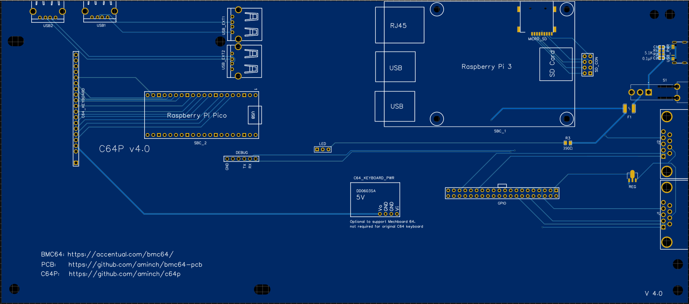
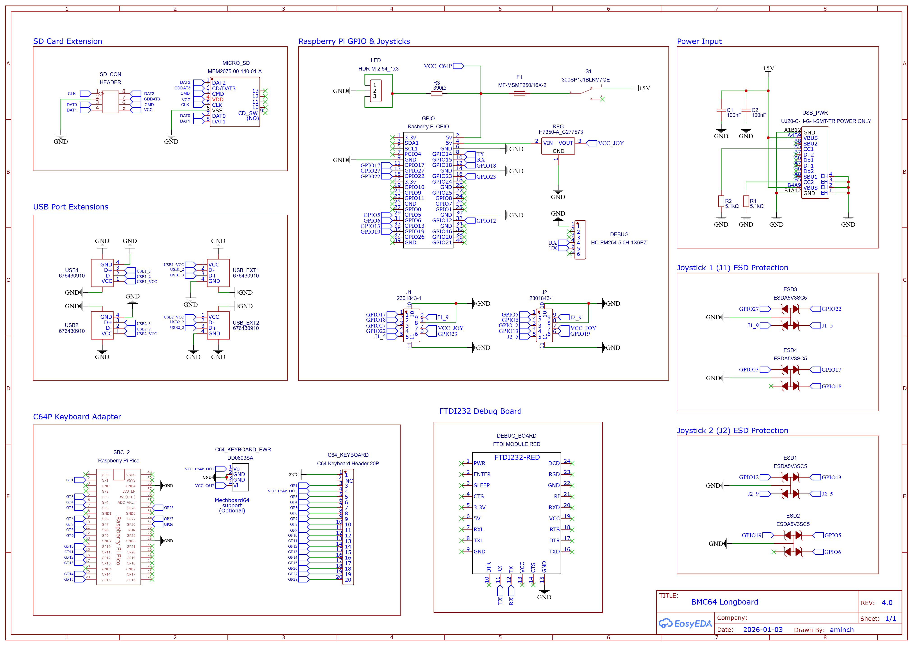
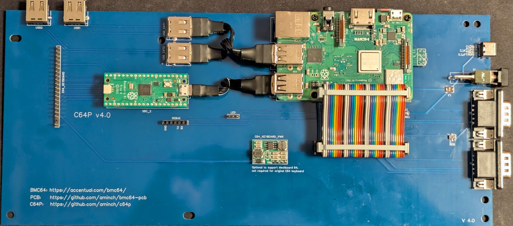

# BMC64 PCB (Longboard 4.0)

This Longboard README contains details on the longboard variant of the BMC64 PCB.

All differences from the [shortboard](README.md) are only cosmetic when running BMC64 with a Raspberry Pi 3B+.

The differences from the shortboard are:

 * Looks cooler!!! 😃 
   * That's a matter of opinion, but I brought this form factor back as it's where the project started...
 * Uses a [Raspberry Pi Pico](https://www.raspberrypi.com/products/raspberry-pi-pico/) instead of a [Waveshare RP2040-Zero](https://www.waveshare.com/wiki/RP2040-Zero).
 * Uses single USB2 ports instead of stacked USB3.

---

- [BMC64 PCB (Longboard 4.0)](#bmc64-pcb-longboard-40)
  - [PCBs \& Parts](#pcbs--parts)
    - [Main PCB - Longboard](#main-pcb---longboard)
    - [MicroSD card adapter board](#microsd-card-adapter-board)
    - [BOM](#bom)
    - [Ordering PCBs](#ordering-pcbs)
    - [Schematics](#schematics)
  - [Assembly](#assembly)
  - [Software](#software)
  - [History](#history)
  - [Disclaimer](#disclaimer)

## PCBs & Parts

### Main PCB - Longboard

### MicroSD card adapter board

 The adapter board is used to connect the MicroSD slot on the Raspberry Pi 3B+ to the main PCB

### BOM

Full [BOM (Longboard)](bom/longboard-bom.md) of parts needed.

### Ordering PCBs

I ordered the PCBs via [JLCPCB](https://jlcpcb.com/) with just the standard settings. The main PCB was the standard 1.6mm thick, but it is important to order the MicroSD adapter board in **0.6mm** or **0.8mm** thick or it will be too big to fit into the microSD slot on the Raspberry Pi 3B+!

Check the [Releases](https://github.com/aminch/bmc64-pcb/releases/tag/V2.0.5), or `gerbers` folder for the gerber files.

### Schematics

## Assembly

Follow the assembly instructions in the main [README](README.md#assembly). 

The only differences are the single USB2 ports, and 2x 1x20 female headers for mounting the Raspberry Pi Pico. The final assembled board show look as below.

The board will fit inside a C64C or breadbin case and all ports, the power switch and USB-C power connector use the existing holes in the case. It is mounted using screws to the existing stand-offs inside the case. 

## Software

See [Software](README.md#software) for full details

## History

See [History](README.md#history) for full details

## Disclaimer

This project is just a fun personal experiment for education and is not intended for professional or commercial use. I'm not an electrical engineer, so please use any information, code, or designs here at your own risk. 
