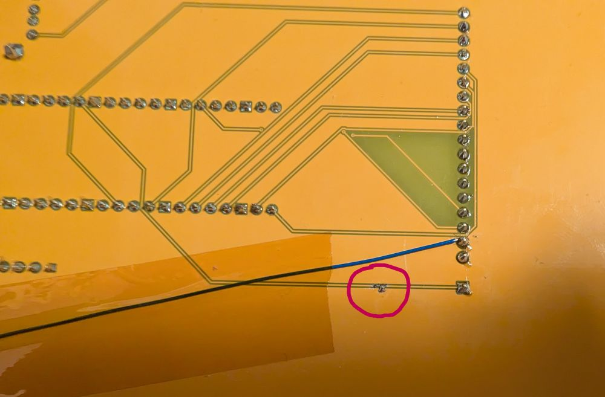
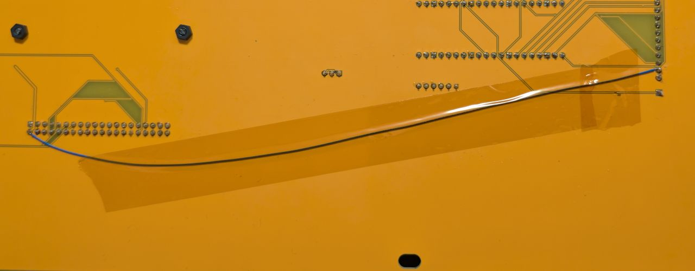
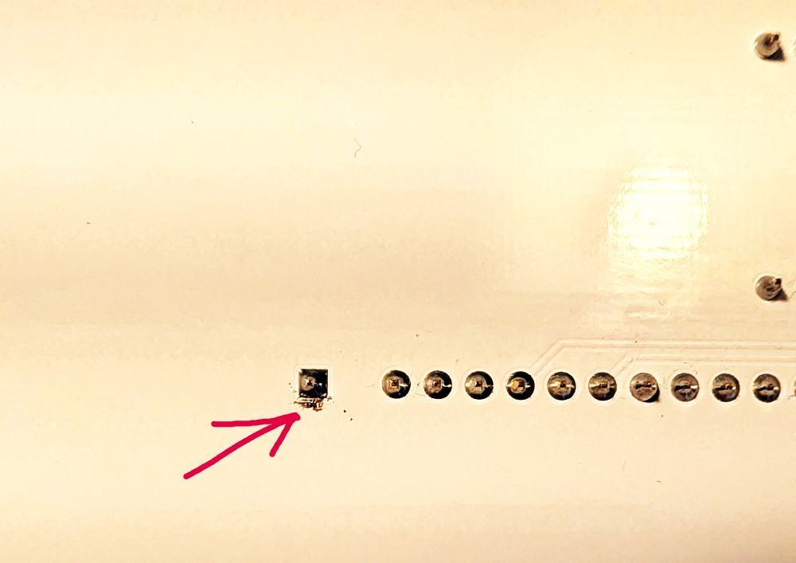
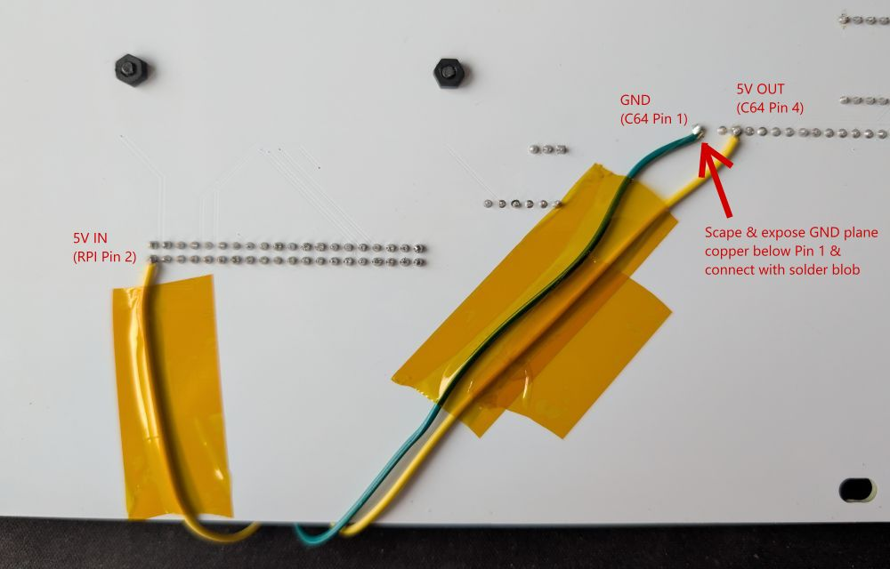
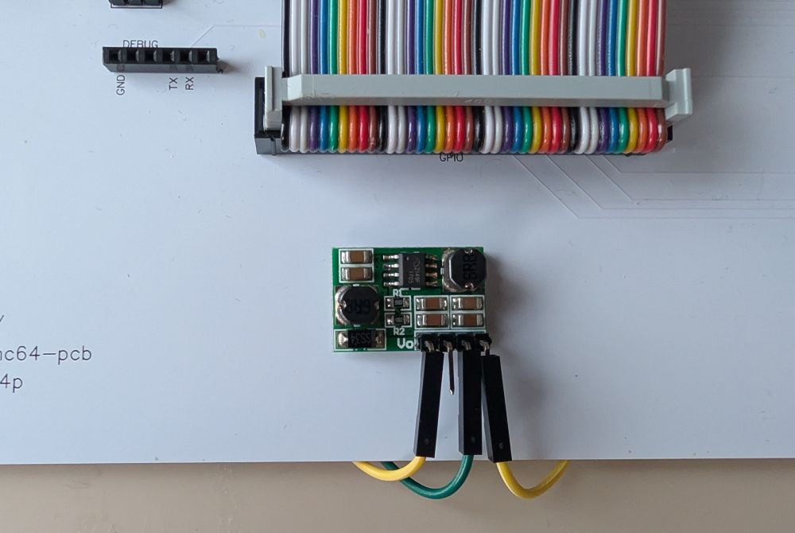
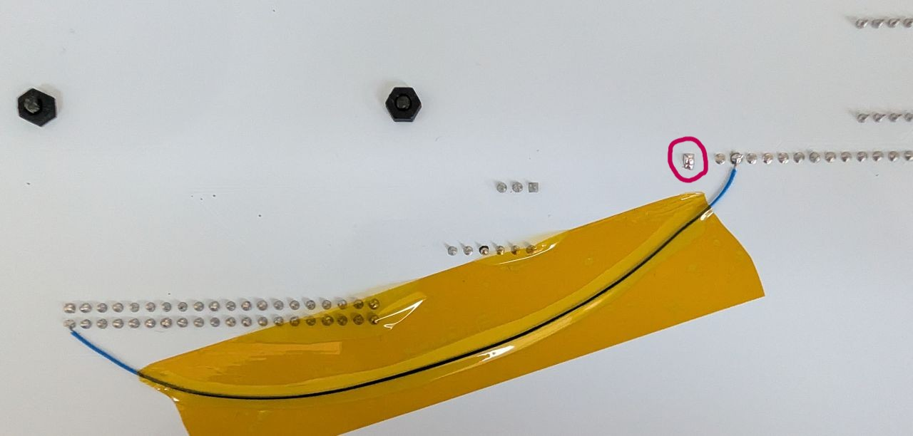

# Modifications

Any of the pre v4.0 PCBs can be modified to work with v4.0 or greater C64P firmware.

Once a PCB is modified it **WILL NOT** work with the older firmware.

Note: Proceed **AT YOUR OWN RISK**. If in doubt just order new v4.0 PCBs.

## Modification Steps

The steps are the same for any PCB. They are:

 * Cut the trace leading from Pin 1 on C64 header to the GPIO header on the Pico/RP2040-Zero.
   * Note: This will be going to GPIO 5 on Unversioned boards and GPIO 0 on v2.0 boards. 
 * Connect Pin 1 on C64 header to ground (GND). 
   * The easiest way to do that is to scratch off some of the PCB upper layer next to Pin 1 on the back of the board and expose copper on the ground plane. Then simply join the pin to the ground plane with a solder blob. (See below)
 * The next step is **ONLY** needed if you want to support the Mechboard 64, you **DO NOT** need to do this for original C64 keyboards to work.
   * Connect Pin 4 on C64 keyboard header to 5V power. There are two ways to do this:
     * Connect directly between Pin 4 on the C64 keyboard header and Pin 2 (5V) on Raspberry Pi. 
       * This will work but as explained in the [Keyboards section](README.md#keyboards), direct connection of the 5V will lead to LEDs that will not have a consistent brightness.
     * Connect a DDO603SA as per the [schematic](README.md/#schematics) for a v4.0 board and tape it to the board with some double sided tape. (See below)
     * Otherwise just order a v4.0 PCB - This is your **BEST** option. 
 * Update the Pico/RP2040-Zero on the C64P with the correct firmware:
   * `c64p_default.uf2` - for v2.0 C64Ps
   * `c64p_legacy_default.uf2` - for Unversioned C64Ps
 * That's it!

## Sample modified PCBs

Below are some pictures of some PCBs on which I modified the C64P to work with firmware v4.0

### BMC64-PCB v2.0.5 (unversioned C64P)

Below circled in **red** is the cut trace from Pin 1 on the bottom side of a v2.0.5 board with an unversioned C64P. The ground plane was scraped to expose the copper and a solder blob joins the trace to ground.

The wire shown on the bottom side here show the direct connecting of Pin 4 on the C64 keyboard header and Pin 2 (5V) on Raspberry Pi. This is the direct connection option for Mechboard 64 support, which will have the inconsistent brightness issue.

This v2.0.5 board will now support C64P firmware v4.0 and higher.

### BMC64-PCB v2.2 (v2.0 C64P)

Below circled in **red** is the cut trace from Pin 1, which is on the top of the board.

Below the **red** arrow points to when you need to scrape the top layer off to expose the ground plane so it can be connected to Pin 1 on the C64 keyboard header with a solder blob.

The wires show how to connect the 5V IN, GND and 5V OUT to the DDO603SA on the bottom of the board. This method will avoid the inconsistent brightness issue.

 * 5V IN connects to Pin 2 (5V) on Raspberry Pi
 * GND connects to Pin 1 on the C64 keyboard header, which before connecting you need to scrape the area next to it to expose the copper on the ground plane then join Pin 1 to the ground plane then connect the wire
 * 5V OUT connects to Pin 4 on the C64 keyboard header

Below is how I positioned the DDO603SA on the front of the board with double sided tape.

This v2.2 board will now support C64P firmware v4.0 and higher.

---

Below is shown the alternative direct wiring on a v2.2 board, but this will have the brightness inconsistency problem. 

Note: this also requires the ground plane scraping and connecting Pin 1 on the C64 keyboard header to GND, which you can see in the same picture circled in **red**.

