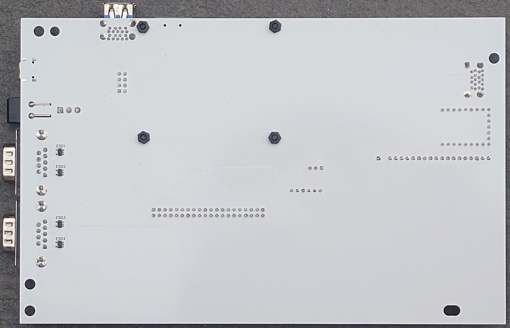

# BMC64 PCB

The BMC64 PCB combines together a [Raspberry Pi 3B+](https://www.raspberrypi.com/products/raspberry-pi-3-model-b-plus/), [Waveshare RP2040-Zero](https://www.waveshare.com/wiki/RP2040-Zero), original joystick ports, and USB-C power in a single drop-in board which fits straight into an original breadbin or C64C case with an original C64 keyboard.  It's powered by the fantastic C64 emulator [BMC64](https://accentual.com/bmc64/) and all ports are moved to suitable positions inside an original C64 case for easy access without any case modifications needed! You can also connect up the original LED.

- [BMC64 PCB](#bmc64-pcb)
  - [Revisions](#revisions)
  - [PCBs \& Parts](#pcbs--parts)
    - [Main PCB](#main-pcb)
    - [MicroSD card adapter board](#microsd-card-adapter-board)
    - [BOM](#bom)
    - [Ordering PCBs](#ordering-pcbs)
    - [Schematics](#schematics)
    - [Compatibility](#compatibility)
      - [Keyboards](#keyboards)
      - [Cases](#cases)
  - [Assembly](#assembly)
  - [Software](#software)
    - [Alternative software](#alternative-software)
    - [Debugging BMC64](#debugging-bmc64)
  - [History](#history)
    - [4.0](#40)
    - [2.2](#22)
    - [2.0.5](#205)
    - [2.0.4](#204)
    - [2.0.1](#201)
    - [1.2.1](#121)
    - [1.2](#12)
    - [Pre-PCB solutions](#pre-pcb-solutions)
  - [Disclaimer](#disclaimer)

## Revisions

In the spirit of the original Commodore 64, there are two main sizes of the BMC64 PCB, just as there were two main sizes of [motherboards](https://www.c64-wiki.com/wiki/Motherboard) used in Commodore 64s. I'm even reusing the same naming convention. The longboard and shortboard. The longboards are the original versions of the BMC64 PCB named because the PCB was larger than newer shortboard versions. They use both the expansion (cartridge) port and cassette port holes in the case to expose the HDMI, USB and MicroSD card ports. The short board was introduced in v 2.2. It's smaller and only uses the expansion (cartridge) port to expose the HDMI, USB and MicroSD card ports. 

There have been three major revisions on the BMC64 PCB.

 * [Longboard (v1.2 - v2.0.5)](LONGBOARD.md) - DEPRECATED
 * [Shortboard (v2.2)](SHORTBOARD22.md) - DEPRECATED
 * Shortboard (v4.0) - current, details in this README

If you have an existing PCB it can be [modified](MODIFICATIONS.md) to support the features and firmware for v4.0. Proceed with modifications **AT YOUR OWN RISK**. If in doubt just order new v4.0 PCBs. 

## PCBs & Parts

### Main PCB


### MicroSD card adapter board

 The adapter board is used to connect the MicroSD slot on the Raspberry Pi 3B+ to the main PCB


### BOM

Full [BOM](bom/bom.md) of parts needed.

### Ordering PCBs

I ordered the PCBs via [JLCPCB](https://jlcpcb.com/) with just the standard settings. The main PCB was the standard 1.6mm thick, but it is important to order the MicroSD adapter board in **0.6mm** or **0.8mm** thick or it will be too big to fit into the microSD slot on the Raspberry Pi 3B+!

Check the [Releases](https://github.com/aminch/bmc64-pcb/releases/latest) for the gerber files.

### Schematics


### Compatibility

#### Keyboards

BMC64 PCB is compatible with:

 * Original C64 keyboards
 * [Mechboard 64](https://www.retrofuzion.com/products/mechboard-64-fully-backlit) (support added in v4.0).
  
To support the [Mechboard 64](https://www.retrofuzion.com/products/mechboard-64-fully-backlit), it needs to have the 5V on pin 4 of the C64 Keyboard header active. You can just connect the 5V directly from the main 5V voltage input, it works, kinda, but there is not enough stable voltage from the microcontroller to keep the LEDs a constant brightness. I added a header on which you can install an optional Canton-Power DDO603SA 5V Buck-Boost Converter Module which looks to have solved the problem. (See assembly)

Note: If you are using an original C64 keyboard you can just leave the header for the DDO603SA unpopulated, it is not required.

#### Cases

BMC64 PCB fits inside both the original breadbin and C64C cases. It mounts to the original mounts and reuses existing holes in the case, no modifications required.

## Assembly

The first step in assembly is to attach the microSD adapter board. We will do this by inserting the adapter into the Raspberry Pi 3B+, loosely assembling it in place, then tack soldering the adapter board to the correct location:
 
 * Attach the M2.5 nylon stand-offs to the four corners on the board where the Raspberry Pi 3B+ will be mounted.
 * Cut two 1x4 sets of header pins from the 1x20 header pins in the [BOM](bom/bom.md).
 * Slide the MicroSD adapter into the Raspberry Pi 3B+.
 * Place the 2 sets of 1x4 headers on the main PCB.
 * Place the Raspberry Pi 3B+ on the nylon stand-offs while inserting the header pins into the MicroSD card adapter.
 * Put two (or more) screws into the Raspberry Pi 3B+ to hold everything in place.
 * Place solder on the outer pins on top to holder the header pins in place
 * Flip the board and solder the outer pins on the headers too.
 * Flip the board and carefully remove the Raspberry Pi 3B+, and it should look like the picture below.


 * Confirm that the positioning is ok by placing the Raspberry Pi 3B+ back on the adapter.
 * Adjust the board if needed by reheating the solder on the pins until you're happy.
 * Remove the Raspberry Pi 3B+ again.
 * Complete the final soldering on all of the header pins.

All of the other parts are labelled on the board. Start with the smallest components and work your way up until everything is attached. The list of parts to attach are below and the finished board should look as in the picture:

 * USB-C power port, 2x 5.1K resistors and 2x 0.1µF capacitors
 * Main power switch and fuse
 * 2x DB9 joystick ports and IC Regulator 
 * GPIO header
 * 390ohm resistor & 1x3 LED header
 * 2x Stacked USB 3.0 ports
 * 1x20 header pins (for C64 keyboard)
 * 2x 1x9 and 1x 1x5 female headers for mounting the RP2040-Zero
 * MicroSD card slot
 * Mechboard 64 support (optional):
   * Cut 1x4 header pins from the 1x20 header pins in the [BOM](bom/bom.md).
   * Solder the pins into the header below the GPIO header
   * Solder the DDO603SA 5V Buck-Boost Converter Module onto the pins
 * 1x6 female header for FTDI232 debug points (optional)


You'll need to flip the board for the final components

 * 4x TVS diodes in the ESD1-4 positions next to the joysticks



To assemble the final parts:

 * Push the Waveshare RP2040-Zero into the female headers on the board.
 * Attach the Raspberry Pi 3B+ to the nylon stand-off with screws being careful to slide in the microSD card adapter in the process.
 * Attach the Waveshare RP2040-Zero to the Raspberry Pi 3B+ with a short usb C-A cable.
 * Connect the two USB ports to two of the Raspberry Pi 3B+'s usb ports with the short usb A-A cables.
 * Connect the Raspberry Pi 3B+ to the GPIO connector with the 40pin GPIO ribbon cable. (Note: Cut the cable to suit if desired)
 * Replace the plastic switch on the main switch with the smaller one included in the [BOM](bom/bom.md). (This is needed for the switch to fit correctly in the hole in the C64 case)
 * The finished board should be ready to drop into the case! It should look like it does below:


The fitment of the board inside a C64 breadbin case is shown also shown above. All ports, the power switch and USB-C power connector use the existing holes in the case. It is mounted using screws to the existing stand-offs inside the case. It has mounting holes compatible with the breadbin and C64C cases.

## Software

It runs the [BMC64](https://accentual.com/bmc64/) emulator. Install this onto a MicroSD. You will need to run with the GPIO Config Option #1, and `positional` setting for the keyboard.

You will need to install the latest [C64P](https://github.com/aminch/c64p/releases) firmware on the RP2040-Zero (**do not use** the legacy uf2 file). Do this by connecting it to a PC then dropping the firmware on the drive that is attached. 

For the first run of BMC64 you will need to switch the keyboard into BMC64 mode by pressing `RUN/STOP + F3`. (For details see: [C64P Readme](https://github.com/aminch/c64p))

**Note:** This is a basic PCB. It's designed only for use with the BMC64 emulator, it's not recommended to use any other software on your Raspberry Pi 3B+ when using this PCB. See disclaimer below.

### Alternative software

With the release of v2.0.5, it's now possible to use a [Pi 4B](https://www.raspberrypi.com/products/raspberry-pi-4-model-b/) or [Pi 5](https://www.raspberrypi.com/products/raspberry-pi-5/) (recommended).

Note: BMC64 **IS NOT COMPATIBLE** with Pi 4B or Pi 5!!!

If you use a Pi 4B or Pi 5 you need to run Pi OS then install emulators on PiOS and configure them up to use the GPIO joystick ports. To make this easy you can use [8-bit PC Pi compile](https://github.com/aminch/8-bit-pc-pi-compile), a repository that contains scripts to install Vice and Atari800 emulators onto PiOS Lite. It also includes a menu and configuration to support the bcm-pcb.

C64P also includes a Vice mode to work with an original C64 keyboard. You need to press `RUN/STOP + F5` on first launch. (For details see: [C64P Readme](https://github.com/aminch/c64p))

### Debugging BMC64

An optional debug port can be populated with a 6 position female header. This header connects directly to the [UART port](https://pinout.xyz/pinout/uart) on GPIO pins 14 and 15. The port is labelled with ground (GND), TX and RX, and can use any appropriate debug probe but it has been designed to be pin compatible with a [FTDI FT232RL Type-C to TTL Serial Converter Adapter Module](https://www.aliexpress.com/item/1005007081543813.html) which are super cheap and common on Aliexpress. It is attached to the board as shown below and connected to the computer via USB.


The debug probe is used to view the output log from the BMC64 emulator while it's running to debug problems. You plug in the debug probe and connect with an application such as Putty e.g.

```
 sudo putty /dev/ttyUSB0 - serial -sercfg 115200,8,n,1,N
```

## History

### 4.0

Changes for the 4.0:

 * Major version alignment with BMC64 PCB, C64P PCB, and C64P firmware. All are v4.
 * Added optional support for [Mechboard 64](https://www.retrofuzion.com/products/mechboard-64-fully-backlit)
 * C64P updated to v4.0
 * Positioning adjustment for RP2040-Zero, USB 3.0 extensions and C64 keyboard header for easier connecting.

### 2.2

Changes for the 2.2:

 * Board redesigned into the smaller shortboard footprint
 * Raspberry Pi Pico replaced with RP2040-Zero
 * C64P updated to PCB v2.0 specifications and pinout
 * USB 3.0 stacked extension replaces single USB 2.0 ports
 * C64 keyboard, LED and Debug headers repositioned for smaller size

Check out [this blog post](https://retro.minch.io/2025/09/bmc-pcb-22-with-bmc64/) for details of the journey from v1.2 to v2.2.

### 2.0.5

Changes for the 2.0.5:

 * Repositioning of MicroSD card, USB ports extensions and LED connector
 * Increased trace thickness for VCC / GND on MicroSD adapter
 * MicroSD adapter now compatible with Pi 4B & Pi 5

### 2.0.4

Changes for the 2.0.4:

 * Added debug port to direct connect a FTDI232
 * Extend PCB cut outs for switch for better clearance
 * Minor trace repositioning and clean up

### 2.0.1

Changes for the 2.0.1 model were:

 * ESD protection with TVS diodes added to the joystick ports
 * Added an additional rear facing USB port
 * Repositioned the keyboard header for a cleaner connection
 * Adjusted the mounting holes for better fitment
 * Thicker traces for main power rail
 * Repositioned traces to avoid foot of keyboard mount for C64C case
 
### 1.2.1

Small adjustments on SD_CONN, main power switch and external USB port for improved fitment.

### 1.2

To read the journey from the prototype V1.0 PCB to the V1.2 check out the blog post: [All in One BCM64 PCB](https://retro.minch.io/2025/06/all-in-one-bmc64-pcb/)

### Pre-PCB solutions

Before I went for the single PCB solution I had tried many options to make a clean build for a **new** C64. You can read about that in the series of blog posts I made (link below). You can also find information about the choices I made in this project, such as not connecting an original C64 keyboard directly via GPIO but going for the USB keyboard option.

* [Building a Commodore 64 - Part I - (Why!?!)](https://retro.minch.io/2021/12/building-a-commodore-64-part-i-why/) - The whole journey to here
* [Building a Commodore 64 - Part VIII - (BMC64 Keyboard)](https://retro.minch.io/2022/02/building-a-commodore-64-part-viii-bmc64-keyboard/) - USB keyboard choice specifics 
* [C64P - BMC64 Keyboard](https://retro.minch.io/2023/04/c64p-bmc64-keyboard/) - Original C64 USB Keyboard adapter

## Disclaimer

This project is just a fun personal experiment for education and is not intended for professional or commercial use. I'm not an electrical engineer, so please use any information, code, or designs here at your own risk. 
