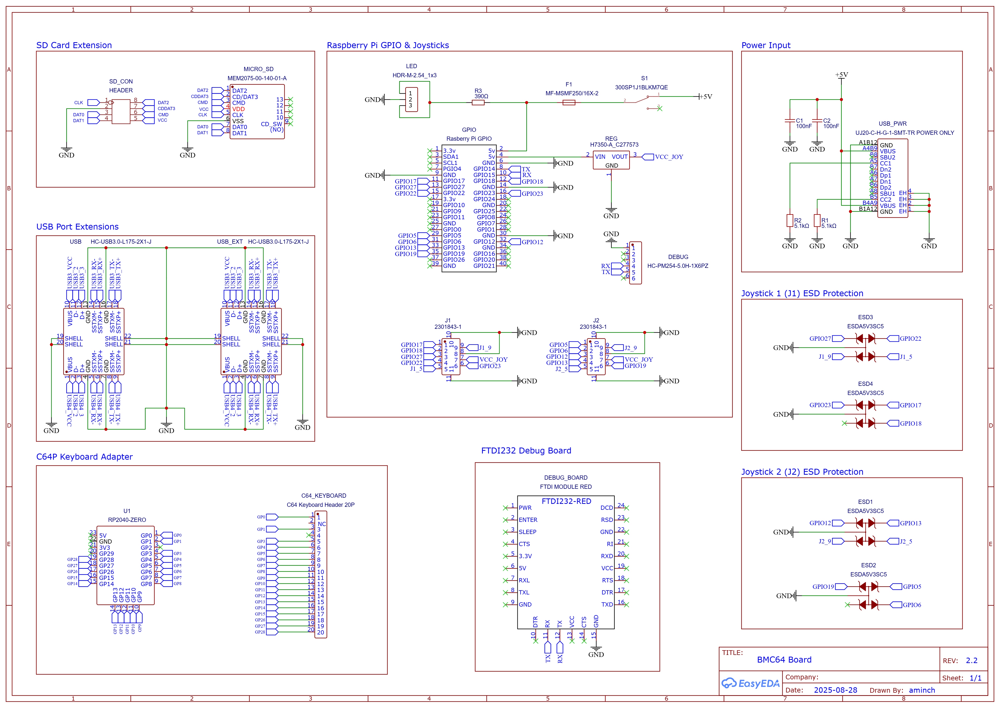
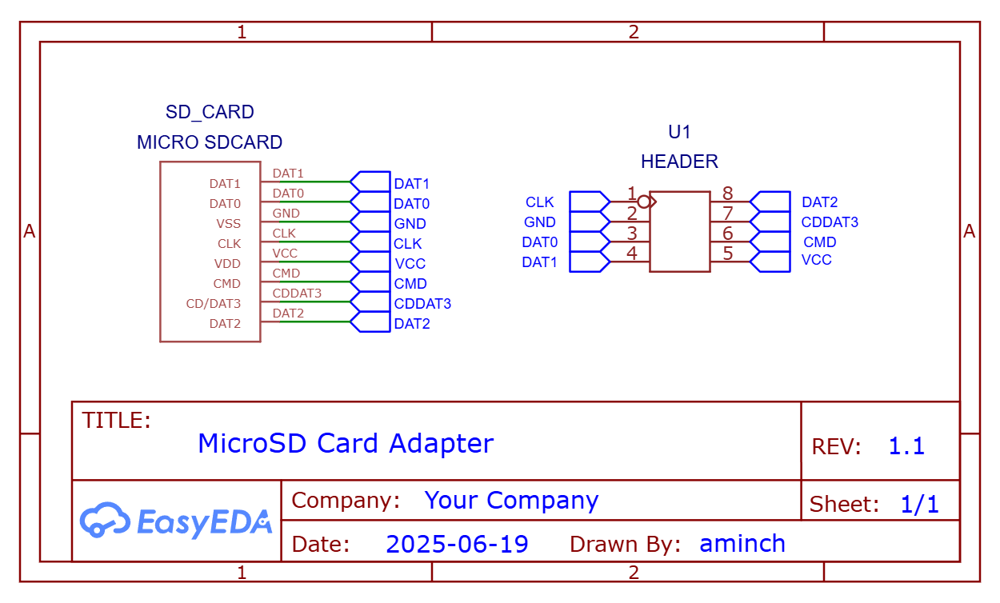

# BMC64 PCB (Shortboard v2.2)

This BMC64 PCB Shortboard v2.2 README details how to build or [modify](MODIFICATIONS.md) the v 2.2 of the BMC64 PCB. The v2.2 PCB is **DEPRECATED**. Go [here](README.md) for the latest board.

The features PCB v2.2 is missing are:

 * Doesn't support [Mechboard 64](https://www.retrofuzion.com/products/mechboard-64-fully-backlit) without [modification](MODIFICATIONS.md)
 * C64P stuck on firmware v3.0 without [modification](MODIFICATIONS.md)
 * See [History](README.md#history) for any future updates

These are not deal breakers but if you are building a new board it is recommended to jump back to the main [README](README.md) and build the latest revision. 

---

- [BMC64 PCB (Shortboard v2.2)](#bmc64-pcb-shortboard-v22)
  - [PCBs \& Parts](#pcbs--parts)
    - [Main PCB](#main-pcb)
    - [MicroSD card adapter board](#microsd-card-adapter-board)
    - [BOM](#bom)
    - [Ordering PCBs](#ordering-pcbs)
    - [Schematics](#schematics)
    - [Compatibility](#compatibility)
  - [Assembly](#assembly)
  - [Software](#software)
    - [Alternative software](#alternative-software)
    - [Debugging BMC64](#debugging-bmc64)
  - [History](#history)
  - [Disclaimer](#disclaimer)

## PCBs & Parts

### Main PCB

### MicroSD card adapter board

 The adapter board is used to connect the MicroSD slot on the Raspberry Pi 3B+ to the main PCB

### BOM

Full [BOM](bom/bom.md) of parts needed.

### Ordering PCBs

I ordered the PCBs via [JLCPCB](https://jlcpcb.com/) with just the standard settings. The main PCB was the standard 1.6mm thick, but it is important to order the MicroSD adapter board in **0.6mm** or **0.8mm** thick or it will be too big to fit into the microSD slot on the Raspberry Pi 3B+!

Check the [Releases](https://github.com/aminch/bmc64-pcb/releases/tag/V2.2), or `gerbers` folder for the gerber files.

### Schematics

### Compatibility

The [C64P](https://github.com/aminch/c64p) used on this PCB is revision v2.0 of the C64P. It is only compatible with C64P [firmware v3.0](https://github.com/aminch/c64p/releases/tag/V3.0) and original C64 keyboards. 

It is **NOT** compatible with [Mechboard 64](https://www.retrofuzion.com/products/mechboard-64-fully-backlit), unless the C64P part of the PCB is [modified](MODIFICATIONS.md).

## Assembly

The first step in assembly is to attach the microSD adapter board. We will do this by inserting the adapter into the Raspberry Pi 3B+, loosely assembling it in place, then tack soldering the adapter board to the correct location:
 
 * Attach the M2.5 nylon stand-offs to the four corners on the board where the Raspberry Pi 3B+ will be mounted.
 * Cut two 1x4 sets of header pins from the 1x20 header pins in the [BOM](bom/bom.md).
 * Slide the MicroSD adapter into the Raspberry Pi 3B+.
 * Place the 2 sets of 1x4 headers on the main PCB.
 * Place the Raspberry Pi 3B+ on the nylon stand-offs while inserting the header pins into the MicroSD card adapter.
 * Put two (or more) screws into the Raspberry Pi 3B+ to hold everything in place.
 * Place solder on the outer pins on top to holder the header pins in place
 * Flip the board and solder the outer pins on the headers too.
 * Flip the board and carefully remove the Raspberry Pi 3B+, and it should look like the picture below.

 * Confirm that the positioning is ok by placing the Raspberry Pi 3B+ back on the adapter.
 * Adjust the board if needed by reheating the solder on the pins until you're happy.
 * Remove the Raspberry Pi 3B+ again.
 * Complete the final soldering on all of the header pins.

All of the other parts are labelled on the board. Start with the smallest components and work your way up until everything is attached. The list of parts to attach are below and the finished board should look as in the picture:

 * USB-C power port, 2x 5.1K resistors and 2x 0.1µF capacitors
 * Main power switch and fuse
 * 2x DB9 joystick ports and IC Regulator 
 * GPIO header
 * 390ohm resistor & 1x3 LED header
 * 2x Stacked USB 3.0 ports
 * 1x20 header pins (for C64 keyboard)
 * 2x 1x9 and 1x 1x5 female headers for mounting the RP2040-Zero
 * MicroSD card slot
 * 1x6 female header for FTDI232 debug points (optional)

You'll need to flip the board for the final components

 * 4x TVS diodes in the ESD1-4 positions next to the joysticks

To assemble the final parts:

 * Push the Waveshare RP2040-Zero into the female headers on the board.
 * Attach the Raspberry Pi 3B+ to the nylon stand-off with screws being careful to slide in the microSD card adapter in the process.
 * Attach the Waveshare RP2040-Zero to the Raspberry Pi 3B+ with a short usb C-A cable.
 * Connect the two USB ports to two of the Raspberry Pi 3B+'s usb ports with the short usb A-A cables.
 * Connect the Raspberry Pi 3B+ to the GPIO connector with the 40pin GPIO ribbon cable. (Note: Cut the cable to suit if desired)
 * Replace the plastic switch on the main switch with the smaller one included in the [BOM](bom/bom.md). (This is needed for the switch to fit correctly in the hole in the C64 case)
 * The finished board should be ready to drop into the case! It should look like it does below:

The fitment of the board inside a C64 breadbin case is shown also shown above. All ports, the power switch and USB-C power connector use the existing holes in the case. It is mounted using screws to the existing stand-offs inside the case. It has mounting holes compatible with the breadbin and C64C cases.

## Software

BMC64 PCB v2.2 has the C64P v2.0 revision. You **MUST** use the v3.0 [c64p_default.uf2](https://github.com/aminch/c64p/releases/download/V3.0/c64p_default.uf2) build of the uf2 firmware as the C64P doesn't support anything newer without [modification](MODIFICATIONS.md).

See: [Software](README.md#software) for all other details.

### Alternative software

See: [Alternative Software](README.md#alternative-software) for more details.

### Debugging BMC64

See [Debugging BMC64](README.md#debugging-bmc64) for full details

## History

See [History](README.md#history) for full details

## Disclaimer

This project is just a fun personal experiment for education and is not intended for professional or commercial use. I'm not an electrical engineer, so please use any information, code, or designs here at your own risk. 
